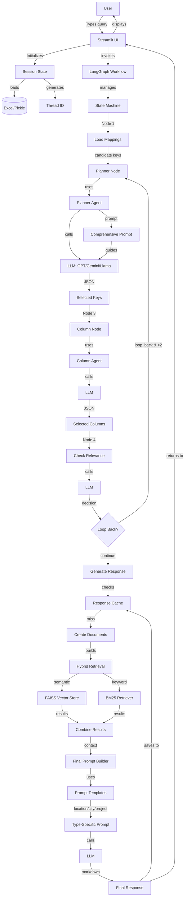

# PropGPT v3 - Complete System Guide

## Table of Contents
1. [System Overview](#system-overview)
2. [Technology Stack Explained](#technology-stack-explained)
3. [LLM Models Used](#llm-models-used)
4. [LangGraph Deep Dive](#langgraph-deep-dive)
5. [Relevance Checking Logic](#relevance-checking-logic)
6. [Complete Workflow](#complete-workflow)
7. [How Everything Works Together](#how-everything-works-together)

---

## System Overview

### What is PropGPT?

**PropGPT v3** is an intelligent real estate analytics platform that combines:
- **Data Analysis**: Pune real estate data from 2020-2024
- **AI Intelligence**: Multiple LLM providers (OpenAI, Google, GitHub)
- **Smart Retrieval**: Hybrid search (semantic + keyword)
- **Workflow Orchestration**: LangGraph state machine
- **Conversational Memory**: Context-aware responses

### Core Purpose

Transform complex real estate data into natural language insights by:
1. Understanding user questions in plain English
2. Automatically selecting relevant data metrics
3. Retrieving precise information using AI
4. Generating comprehensive, formatted analysis
5. Maintaining conversation context

---

## Technology Stack Explained

### 1. **Streamlit** (Frontend Framework)

**What It Is**: Python web framework for data apps

**How It Works**:
- Runs as Python script
- Auto-refreshes on code changes
- Manages session state across interactions
- Renders UI components (text, buttons, chat)

**Why We Use It**:
- Fast prototyping
- Built-in chat interface
- Session management
- No JavaScript needed

**Key Code**:
```python
# Streamlit automatically re-runs top to bottom on interaction
import streamlit as st

# Session state persists across reruns
if "messages" not in st.session_state:
    st.session_state.messages = []

# Chat interface
st.chat_message("user").write("Hello!")
```

---

### 2. **LangChain** (LLM Framework)

**What It Is**: Framework for building LLM applications

**How It Works**:
- Provides unified interface for multiple LLM providers
- Handles prompt templates
- Manages conversation history
- Integrates retrieval systems

**Key Components We Use**:
```python
from langchain_openai import ChatOpenAI
from langchain_google_genai import ChatGoogleGenerativeAI
from langchain.schema import Document, HumanMessage, AIMessage
from langchain_community.vectorstores import FAISS
from langchain_community.retrievers import BM25Retriever
```

**Why We Use It**:
- Abstracts LLM provider differences
- Built-in Document handling
- Retrieval integrations
- Message history management

---

### 3. **LangGraph** (Workflow Orchestration)

**What It Is**: Library for building stateful, multi-agent workflows

**How It Works**:
LangGraph treats workflows as **state machines** where:
- **Nodes** = Processing steps (functions)
- **Edges** = Transitions between nodes
- **State** = Data passed between nodes
- **Conditional Edges** = Dynamic routing based on conditions

**Core Concepts**:

#### State Definition
```python
from typing import TypedDict, List, Any
from langchain.schema import BaseMessage

class AgentState(TypedDict):
    # Input data
    query: str                          # User's question
    llm: Any                           # LLM instance
    comparison_type: str               # Location/City/Project
    
    # Intermediate results
    candidate_keys: List[str]          # Available mapping keys
    candidate_columns: List[str]       # Available columns
    selected_keys: List[str]           # LLM-chosen keys
    selected_columns: List[str]        # LLM-chosen columns
    
    # Control flow
    messages: List[BaseMessage]        # Chat history
    iteration_count: int               # Loop counter
    
    # Output
    final_response: str                # Generated answer
```

#### Why State Matters
- **Immutability**: Each node receives state, returns updates
- **Persistence**: State saved/loaded via Checkpointer
- **Traceability**: Full history of state changes
- **Memory**: Conversations resume from last state

---

### 4. **FAISS** (Vector Search)

**What It Is**: Facebook AI Similarity Search - fast vector database

**How It Works**:
1. **Embedding Creation**:
   ```python
   # Convert text to 768-dimensional vector
   embedding = embeddings.embed_query("flat sales in baner")
   # → [0.123, -0.456, 0.789, ...]
   ```

2. **Index Building**:
   ```python
   # Store all document vectors
   faiss_index = FAISS.from_documents(documents, embeddings)
   ```

3. **Similarity Search**:
   ```python
   # Find most similar vectors
   results = faiss_index.similarity_search(query, k=6)
   # Uses cosine similarity or L2 distance
   ```

**Why We Use It**:
- **Semantic Search**: Finds similar meaning, not just keywords
- **Fast**: Optimized for million-scale searches
- **Scalable**: Handles large document collections

**Example**:
- Query: "flat demand"
- Matches: "Property type wise Units Sold" (even without "demand" term)

---

### 5. **BM25** (Keyword Search)

**What It Is**: Best Match 25 - probabilistic keyword ranking algorithm

**How It Works**:
```
Score = IDF(term) × (TF × (k1 + 1)) / (TF + k1 × (1 - b + b × (DL / AVGDL)))

Where:
- TF = Term Frequency (how often term appears)
- IDF = Inverse Document Frequency (how rare the term is)
- DL = Document Length
- AVGDL = Average Document Length
- k1, b = Tuning parameters
```

**Why We Use It**:
- **Exact Matching**: Catches specific keywords
- **Complements FAISS**: Semantic + Keyword = Best Recall
- **No Training**: Works immediately on any text

**Example**:
- Query: "2023 baner"
- BM25 prioritizes documents literally containing "2023" and "baner"

---

### 6. **Hybrid Retrieval** (Combined Search)

**How It Works**:
```python
def hybrid_retrieve(query, mapping_keys, vector_store, bm25_retriever, top_k=6):
    results = []
    
    for key in mapping_keys:
        # 1. Semantic search (FAISS)
        semantic_docs = vector_store.similarity_search(
            query, 
            k=top_k,
            filter={"mapping_key": key}
        )
        
        # 2. Keyword search (BM25)
        keyword_docs = bm25_retriever.get_relevant_documents(query, k=top_k)
        keyword_docs = [d for d in keyword_docs if d.metadata["mapping_key"] == key]
        
        # 3. Combine and deduplicate
        combined = semantic_docs + keyword_docs
        seen = set()
        unique = []
        for doc in combined:
            content_hash = hash(doc.page_content)
            if content_hash not in seen:
                unique.append(doc)
                seen.add(content_hash)
        
        results.extend(unique[:top_k])
    
    return results
```

**Benefits**:
- **FAISS**: "flat sales" → matches "units sold"
- **BM25**: "2023" → ensures year-specific results
- **Together**: Maximum accuracy

---

### 7. **Semantic Response Cache**

**What It Is**: Smart cache that matches similar queries

**How It Works**:
```python
class SemanticResponseCache:
    def get(self, query, items, mapping_keys, ...):
        # 1. Generate cache key
        key = hash(query + str(items) + str(mapping_keys) + ...)
        
        # 2. Check exact match
        if key in self.cache:
            return cached_response
        
        # 3. Compute query embedding
        query_embedding = self.embeddings.embed_query(query)
        
        # 4. Check semantic similarity
        for cached_key, cached_entry in self.cache.items():
            similarity = cosine_similarity(
                query_embedding, 
                cached_entry["embedding"]
            )
            
            # 5. Return if similar enough
            if similarity >= self.threshold:  # default 0.95
                return cached_entry["response"]
        
        return None  # Cache miss
```

**Benefits**:
- Matches similar queries: "flat sales" ≈ "unit sales"
- 10-100x faster than LLM call
- Reduces API costs
- Configurable similarity threshold

---

## LLM Models Used

### 1. **OpenAI GPT-4o-mini**

**Configuration**:
```python
ChatOpenAI(
    model="gpt-4o-mini",
    temperature=0,
    api_key=os.getenv("OPENAI_API_KEY")
)
```

**Characteristics**:
- **Speed**: Fast (1-2 seconds)
- **Cost**: Low ($0.150/1M input tokens)
- **Quality**: High accuracy for structured tasks
- **Context**: 128K tokens
- **Best For**: Query understanding, data selection

**Why We Use It**:
- Excellent at JSON output
- Strong reasoning for key selection
- Reliable for agent tasks

---

### 2. **Google Gemini 2.0 Flash Exp**

**Configuration**:
```python
ChatGoogleGenerativeAI(
    model="gemini-2.0-flash-exp",
    temperature=0,
    api_key=os.getenv("GOOGLE_API_KEY")
)
```

**Characteristics**:
- **Speed**: Very fast (< 1 second)
- **Cost**: Free (experimental)
- **Quality**: Competitive with GPT-4
- **Context**: 1M tokens
- **Best For**: Long context analysis

**Why We Use It**:
- Handles large data contexts well
- Fast response generation
- Free tier available

---

### 3. **Llama 3.3 70B Instruct** (via GitHub Models)

**Configuration**:
```python
ChatOpenAI(
    base_url="https://models.inference.ai.azure.com",
    model="Llama-3.3-70B-Instruct",
    api_key=os.getenv("GITHUB_API_KEY")
)
```

**Characteristics**:
- **Speed**: Medium (2-4 seconds)
- **Cost**: Free (GitHub Models)
- **Quality**: Open-source, strong reasoning
- **Context**: 128K tokens
- **Best For**: Alternative to commercial models

**Why We Use It**:
- Open-source option
- Free via GitHub
- Good for experimentation

---

### Model Selection Logic

```python
def get_llm(provider_name=None):
    # Priority:
    # 1. Explicit parameter
    # 2. Session state
    # 3. Environment variable
    # 4. Default (OpenAI)
    
    provider = provider_name or \
               st.session_state.get('llm_provider') or \
               os.getenv('USE_LLM', 'openai')
    
    if provider == "openai":
        return ChatOpenAI(...)
    elif provider == "gemini":
        return ChatGoogleGenerativeAI(...)
    elif provider == "github":
        return ChatOpenAI(base_url="...", ...)
```

**Usage in Code**:
- **Agents**: Use GPT-4o-mini for precision
- **Generation**: Use Gemini for long context
- **Fallback**: Switch providers if one fails

---

## LangGraph Deep Dive

### Graph Architecture

```python
from langgraph.graph import StateGraph, END
from langgraph.checkpoint.memory import MemorySaver

# Define workflow
workflow = StateGraph(AgentState)

# Add nodes (processing steps)
workflow.add_node("load_mappings", load_mappings_node)
workflow.add_node("planner", planner_node)
workflow.add_node("column_node", column_node)
workflow.add_node("check_relevance", check_relevance_node)
workflow.add_node("generate_response", generate_response_node)

# Add edges (transitions)
workflow.set_entry_point("load_mappings")
workflow.add_edge("load_mappings", "planner")
workflow.add_edge("planner", "column_node")
workflow.add_edge("column_node", "check_relevance")

# Add conditional edge (decision point)
workflow.add_conditional_edges(
    "check_relevance",
    should_loop_back,  # Function that returns "continue" or "loop_back"
    {
        "continue": "generate_response",
        "loop_back": "planner"
    }
)

workflow.add_edge("generate_response", END)

# Compile with memory
checkpointer = MemorySaver()
app = workflow.compile(checkpointer=checkpointer)
```

---

### Node Functions Explained

#### 1. **load_mappings_node**

**Purpose**: Initialize available mapping keys and columns

```python
def load_mappings_node(state: AgentState) -> dict:
    comparison_type = state["comparison_type"]
    
    # Get mappings for this comparison type
    category_mapping = get_category_mapping(comparison_type)
    column_mapping = get_column_mapping(comparison_type)
    
    # Extract all keys and columns
    candidate_keys = list(column_mapping.keys())
    candidate_columns = []
    for cols in column_mapping.values():
        candidate_columns.extend(cols)
    
    return {
        "candidate_keys": candidate_keys,
        "candidate_columns": list(set(candidate_columns))
    }
```

**Output**: Populates `candidate_keys` and `candidate_columns` in state

---

#### 2. **planner_node** (Key Selection)

**Purpose**: Select relevant mapping keys using LLM

```python
def planner_node(state: AgentState) -> dict:
    query = state["query"]
    llm = state["llm"]
    candidate_keys = state["candidate_keys"]
    
    # Call intelligent agent
    selected_keys = planner_identify_mapping_keys(
        llm, 
        query, 
        candidate_keys
    )
    
    return {"selected_keys": selected_keys}
```

**How `planner_identify_mapping_keys` Works**:

1. **Query Classification**:
   ```python
   # Detect query type
   metric_type = _classify_metric(query)  # "supply", "demand", "both"
   is_demo = _is_demography_query(query)  # True/False
   property_mentions = _detect_property_mentions(query)  # {has_bhk, has_property_type}
   ```

2. **LLM Prompt Construction**:
   ```python
   prompt = f"""
   User Query: {query}
   
   CANDIDATE_KEYS:
   {json.dumps(candidate_keys, indent=2)}
   
   STEP 1: IDENTIFY QUERY TYPE
   A. PROJECT METADATA - name, location, dates, phases
   B. INFRASTRUCTURE - buildings, floors, capacity
   C. COMPOSITION - property type share/percentage
   D. DEMOGRAPHIC - buyer pincodes, age ranges
   E. SUPPLY - total units, available units
   F. DEMAND - units sold, transactions
   G. PRICING - rates, prices
   
   STEP 2: SELECT RELEVANT KEYS
   Select ONLY keys that match the query type.
   
   STEP 3: OUTPUT
   Return JSON array of selected keys.
   """
   ```

3. **LLM Call**:
   ```python
   response = llm.invoke(prompt)
   # Response: '["Property type wise Units Sold", "Location"]'
   ```

4. **Parse and Validate**:
   ```python
   parsed = json.loads(response.content)
   filtered = [key for key in parsed if key in candidate_keys]
   return filtered[:6]  # Max 6 keys
   ```

**Output**: Updates `selected_keys` in state

---

#### 3. **column_node** (Column Selection)

**Purpose**: Select specific columns from chosen mapping keys

```python
def column_node(state: AgentState) -> dict:
    query = state["query"]
    llm = state["llm"]
    selected_keys = state["selected_keys"]
    
    # Get columns for selected keys
    column_mapping = get_column_mapping(state["comparison_type"])
    candidate_columns = []
    for key in selected_keys:
        if key in column_mapping:
            candidate_columns.extend(column_mapping[key])
    
    # Filter columns using LLM
    selected_columns = agent_pick_relevant_columns(
        llm,
        query,
        selected_keys,
        candidate_columns
    )
    
    return {"selected_columns": selected_columns}
```

**How `agent_pick_relevant_columns` Works**:

```python
def agent_pick_relevant_columns(llm, query, selected_keys, candidate_columns):
    prompt = f"""
    Query: {query}
    Selected Keys: {selected_keys}
    Candidate Columns: {candidate_columns}
    
    Select ONLY columns needed to answer the query.
    Return JSON array of column names.
    """
    
    response = llm.invoke(prompt)
    parsed = json.loads(response.content)
    return [col for col in parsed if col in candidate_columns]
```

**Output**: Updates `selected_columns` in state

---

#### 4. **check_relevance_node** (Quality Control)

**Purpose**: Verify selections are appropriate, loop back if not

```python
def check_relevance_node(state: AgentState) -> dict:
    query = state["query"]
    llm = state["llm"]
    selected_keys = state["selected_keys"]
    selected_columns = state["selected_columns"]
    
    # Build validation prompt
    prompt = f"""
    Query: {query}
    Selected Mapping Keys: {selected_keys}
    Selected Columns: {selected_columns}
    
    Are these selections relevant to answer the query?
    
    Respond with ONLY:
    - "continue" if selections are good
    - "loop_back" if selections are wrong/irrelevant
    """
    
    response = llm.invoke(prompt)
    decision = response.content.strip().lower()
    
    # Update iteration count
    iteration_count = state.get("iteration_count", 0) + 1
    
    return {
        "decision": decision,
        "iteration_count": iteration_count
    }
```

**Output**: Updates `decision` and `iteration_count` in state

---

#### 5. **should_loop_back** (Conditional Router)

**Purpose**: Decide whether to refine selections or continue

```python
def should_loop_back(state: AgentState) -> str:
    decision = state.get("decision", "continue")
    iteration_count = state.get("iteration_count", 0)
    
    # Maximum 2 iterations to prevent infinite loops
    if decision == "loop_back" and iteration_count < 2:
        return "loop_back"  # Go back to planner
    else:
        return "continue"   # Proceed to generation
```

**Returns**: `"loop_back"` or `"continue"`

**Effect**:
- `"loop_back"` → Returns to `planner_node` for new selections
- `"continue"` → Proceeds to `generate_response_node`

---

#### 6. **generate_response_node** (Final Generation)

**Purpose**: Retrieve data and generate answer

```python
def generate_response_node(state: AgentState) -> dict:
    query = state["query"]
    llm = state["llm"]
    selected_keys = state["selected_keys"]
    selected_columns = state["selected_columns"]
    
    # Check response cache
    cached = response_cache.get(query, items, selected_keys, ...)
    if cached:
        return {"final_response": cached}
    
    # Create documents from DataFrame
    documents = create_documents(
        df, 
        items, 
        selected_columns, 
        selected_keys,
        ...
    )
    
    # Build retrieval system
    vector_store = build_vector_store(documents, embeddings)
    bm25_retriever = build_bm25_retriever(documents)
    
    # Hybrid retrieval
    retrieved_docs = hybrid_retrieve(
        query, 
        selected_keys, 
        vector_store, 
        bm25_retriever
    )
    
    # Build final prompt
    context = "\n\n".join([doc.page_content for doc in retrieved_docs])
    prompt = build_location_prompt(
        query, 
        items, 
        selected_keys, 
        selected_columns, 
        context,
        ...
    )
    
    # Generate response
    response = llm.invoke(prompt)
    
    # Cache response
    response_cache.set(query, items, selected_keys, response.content)
    
    return {"final_response": response.content}
```

**Output**: Updates `final_response` in state

---

### Graph Execution

**Invocation**:
```python
# Generate unique thread ID for conversation
thread_id = str(uuid.uuid4())

# Initial state
initial_state = {
    "query": "Which area had better flat sales in 2023?",
    "llm": get_llm("gemini"),
    "comparison_type": "Location",
    "messages": [],
    "iteration_count": 0
}

# Execute graph with memory
config = {"configurable": {"thread_id": thread_id}}
final_state = app.invoke(initial_state, config=config)

# Extract results
selected_keys = final_state["selected_keys"]
selected_columns = final_state["selected_columns"]
final_response = final_state["final_response"]
```

**Memory Persistence**:
```python
# MemorySaver stores state by thread_id
# Same thread_id = Resume conversation
# Different thread_id = New conversation

# Resume previous conversation
same_thread_config = {"configurable": {"thread_id": "abc-123"}}
continued_state = app.invoke(new_query, config=same_thread_config)
```

---

### Why LangGraph?

**Benefits**:
1. **Structured Workflows**: Clear, maintainable flow
2. **State Management**: Automatic state passing
3. **Conditional Logic**: Dynamic routing (loop back)
4. **Memory**: Conversation persistence
5. **Traceability**: Full execution history
6. **Error Recovery**: Fallback logic per node

**Alternative (Without LangGraph)**:
```python
# Messy, hard to maintain
selected_keys = planner(query, candidate_keys)
if not is_relevant(selected_keys):
    selected_keys = planner(query, candidate_keys)  # Try again
selected_columns = column_selector(selected_keys)
if not is_relevant(selected_columns):
    selected_columns = column_selector(selected_keys)  # Try again
response = generate(selected_keys, selected_columns)
```

**With LangGraph**:
- Clean node definitions
- Automatic state management
- Configurable max iterations
- Easy to visualize and debug

---

## Relevance Checking Logic

### Why Check Relevance?

**Problem**: LLMs can select wrong keys/columns

**Examples of Failures**:
- Query: "project name and location"
- LLM selects: "Property type wise Units Sold" ❌
- Correct: "Project Name", "Project Location" ✅

**Solution**: Additional LLM call to validate selections

---

### How Relevance Checking Works

#### Step 1: LLM Validates Selections

```python
def check_relevance_node(state: AgentState) -> dict:
    prompt = f"""
    User asked: {query}
    
    We selected these mapping keys: {selected_keys}
    And these columns: {selected_columns}
    
    Question: Will these selections help answer the user's question?
    
    Think step by step:
    1. What is the user asking about?
    2. Do the selected keys match that topic?
    3. Are any critical keys missing?
    4. Are any selected keys irrelevant?
    
    Answer:
    - "continue" if selections are good
    - "loop_back" if selections need refinement
    
    Respond with ONLY one word: continue OR loop_back
    """
    
    response = llm.invoke(prompt)
    decision = response.content.strip().lower()
    
    return {"decision": decision}
```

---

#### Step 2: Decision Logic

```python
def should_loop_back(state: AgentState) -> str:
    decision = state.get("decision", "continue")
    iteration_count = state.get("iteration_count", 0)
    
    # Safety: Max 2 iterations
    MAX_ITERATIONS = 2
    
    if decision == "loop_back" and iteration_count < MAX_ITERATIONS:
        logger.info(f"Looping back for refinement (iteration {iteration_count})")
        return "loop_back"
    else:
        logger.info("Proceeding to response generation")
        return "continue"
```

---

### What Happens on Loop Back?

**Graph Flow**:
```
Initial Try:
START → load_mappings → planner → column_node → check_relevance
                                                       ↓
                                                 [decision: loop_back]
                                                       ↓
Refinement:                               
                         planner → column_node → check_relevance
                                                       ↓
                                                 [decision: continue]
                                                       ↓
                                              generate_response → END
```

**State Preservation**:
- Query, LLM, comparison_type: Unchanged
- candidate_keys, candidate_columns: Unchanged
- selected_keys, selected_columns: **Reset** by planner
- iteration_count: incremented
- messages: Updated with refinement context

**Prompt Enhancement**:
```python
# On second iteration, planner gets additional context
prompt = f"""
Previous selection was rejected as irrelevant.
Try different mapping keys this time.

Query: {query}
Previous keys: {previous_selected_keys}  # Added context
Candidate keys: {candidate_keys}

Select DIFFERENT keys that better match the query.
"""
```

---

### Basis for Relevance Decision

**LLM Considers**:

1. **Semantic Match**:
   - Query: "project name" → Key: "Project Name" ✅
   - Query: "project name" → Key: "Units Sold" ❌

2. **Completeness**:
   - Query asks for 3 metrics → Selected 3 keys ✅
   - Query asks for 3 metrics → Selected 1 key ❌

3. **Specificity**:
   - Query: "2BHK sales" → Key: "BHK wise units sold" ✅
   - Query: "2BHK sales" → Key: "Property type wise sold" ⚠️ (less specific)

4. **Topic Alignment**:
   - Query about demographics → Demographic keys ✅
   - Query about demographics → Price keys ❌

**Example Decision Process**:
```
Query: "Show me demographic profile of buyers"

Selected Keys: ["Property type wise Units Sold", "Total sales (INR)"]

LLM Reasoning:
1. User is asking about: Demographics (buyer profiles)
2. Selected keys are about: Sales transactions and revenue
3. Missing keys: "Top 10 Buyer Pincode units sold", "Age Range wise units sold"
4. Conclusion: loop_back

Refinement:
Selected Keys: ["Top 10 Buyer Pincode units sold", "BHK wise Age Range wise units sold Percentage(%)"]

LLM Reasoning:
1. User is asking about: Demographics
2. Selected keys are about: Buyer pincodes and age distribution
3. Perfect match!
4. Conclusion: continue
```

---

### Fallback Safety

**If stuck in loop_back**:
```python
if iteration_count >= MAX_ITERATIONS:
    # Force continue even if not perfect
    logger.warning("Max iterations reached, proceeding anyway")
    return "continue"
```

**Why**: Prevent infinite loops, user gets *some* response

---

## Complete Workflow

### End-to-End Example

**User Input**:
- Comparison: Location
- Items: ["baner", "hinjewadi"]
- Categories: ["Demand Analysis"]
- Query: "Which area had better 2BHK sales in 2023?"
- Provider: Gemini

---

### Execution Trace

#### Phase 1: Initialization
```
[App] Load pickle: df = load(Pune_Grand_Summary.pkl)
[App] Filter: comparison_type == "Location"
[App] Filter: location in ["baner", "hinjewadi"]
[App] Filter: year in [2020, 2021, 2022, 2023, 2024]
[App] Initialize LLM: Gemini 2.0 Flash
[App] Load mappings: Location mappings
```

#### Phase 2: LangGraph Execution

**Node 1: load_mappings**
```
Input State: {query, llm, comparison_type}
Process: Load category and column mappings
Output: {candidate_keys: [50 keys], candidate_columns: [200 columns]}
```

**Node 2: planner**
```
Input: {query, candidate_keys}

Helper Classifications:
- _classify_metric(query) → "demand"
- _detect_property_mentions(query) → {has_bhk_type: True}

LLM Prompt:
  Query: "Which area had better 2BHK sales in 2023?"
  Type: demand, BHK-specific
  Candidate Keys: [...]
  
  Select keys for: 2BHK sales comparison
  
LLM Response:
  ["BHK types wise units sold", "Location"]
  
Output: {selected_keys: ["BHK types wise units sold", "Location"]}
```

**Node 3: column_node**
```
Input: {selected_keys: ["BHK types wise units sold", "Location"]}

Mapping Lookup:
  "BHK types wise units sold" → ["1BHK_sold", "2BHK_sold", "3BHK_sold", ...]
  "Location" → ["final location"]

LLM Prompt:
  Query mentions: 2BHK, 2023, baner, hinjewadi
  Available columns: ["1BHK_sold", "2BHK_sold", "3BHK_sold", "final location", ...]
  
  Select relevant columns
  
LLM Response:
  ["2BHK_sold", "final location", "year"]
  
Output: {selected_columns: ["2BHK_sold", "final location", "year"]}
```

**Node 4: check_relevance**
```
Input: {
  query: "Which area had better 2BHK sales in 2023?",
  selected_keys: ["BHK types wise units sold", "Location"],
  selected_columns: ["2BHK_sold", "final location", "year"]
}

LLM Prompt:
  Are these selections relevant?
  - User wants: 2BHK sales comparison for 2023
  - Selected: BHK sales data, location, year
  - Match: YES
  
LLM Response: "continue"

Output: {decision: "continue", iteration_count: 1}
```

**Conditional: should_loop_back**
```
Input: {decision: "continue", iteration_count: 1}
Output: "continue"
→ Route to generate_response_node
```

**Node 5: generate_response**
```
Input: {query, llm, selected_keys, selected_columns}

Step 1: Check Cache
  cache_key = hash("Which area had better 2BHK sales in 2023?" + "baner,hinjewadi" + ...)
  cached_response = response_cache.get(cache_key)
  → Cache MISS

Step 2: Create Documents
  documents = create_documents(df, ["baner", "hinjewadi"], ["2BHK_sold", ...], ...)
  
  → Document 1:
     Mapping Key: BHK types wise units sold
     Locations: baner vs hinjewadi
     Years: 2020-2024
     
     2020:
     baner - 1BHK: 100, 2BHK: 250, 3BHK: 80
     hinjewadi - 1BHK: 80, 2BHK: 200, 3BHK: 60
     
     2021:
     ...
     
     2023:
     baner - 1BHK: 150, 2BHK: 400, 3BHK: 120
     hinjewadi - 1BHK: 130, 2BHK: 350, 3BHK: 100

Step 3: Build Retrieval
  vector_store = FAISS.from_documents(documents, embeddings)
  bm25_retriever = BM25Retriever.from_documents(documents)

Step 4: Hybrid Retrieve
  Query: "Which area had better 2BHK sales in 2023?"
  
  FAISS retrieval:
    - Embedding: [0.2, -0.5, 0.8, ...]
    - Top match: Document 1 (0.92 similarity)
  
  BM25 retrieval:
    - Keywords: "2BHK", "sales", "2023"
    - Top match: Document 1 (score: 8.5)
  
  Combined results: [Document 1]

Step 5: Build Final Prompt
  prompt = build_location_prompt(
    query="Which area had better 2BHK sales in 2023?",
    items=["baner", "hinjewadi"],
    mapping_keys=["BHK types wise units sold"],
    selected_columns=["2BHK_sold", "final location", "year"],
    context="2023:\nbaner - 2BHK: 400\nhinjewadi - 2BHK: 350",
    ...
  )
  
  → Full Prompt:
     You are a real estate analyst.
     User asked: Which area had better 2BHK sales in 2023?
     
     Locations to compare: baner, hinjewadi
     Years: 2020-2024
     Focus year: 2023
     
     Retrieved Evidence:
     [Document content with 2BHK sales data]
     
     Analysis Guidelines:
     - Compare 2BHK sales in 2023
     - Identify which location performed better
     - Provide specific numbers
     - Use tables if helpful
     
     Format: Markdown with clear headings

Step 6: Generate Response
  response = llm.invoke(prompt)
  
  → Response:
     # 2BHK Sales Comparison (2023)
     
     ## Summary
     Baner had better 2BHK sales in 2023 with 400 units sold compared to Hinjewadi's 350 units.
     
     ## Detailed Comparison
     | Location | 2BHK Units Sold (2023) |
     |----------|------------------------|
     | Baner    | 400                    |
     | Hinjewadi| 350                    |
     
     **Difference**: Baner sold 50 more units (+14.3%)

Step 7: Cache Response
  response_cache.set(cache_key, response.content, ...)

Output: {final_response: response.content}
```

#### Phase 3: Display
```
[App] Receive final_state from graph
[App] Extract final_response
[App] Clean formatting
[App] Display in chat interface
[App] Update conversation history
[App] Show metadata (tokens, sources)
```

---

## How Everything Works Together

### Architecture Diagram



### Data Flow Summary

1. **User Input** → Streamlit session state
2. **Data Loading** → Filtered DataFrame
3. **Mapping Loading** → Candidate keys/columns
4. **LangGraph Invocation** → State machine execution
5. **Planner Agent** → Key selection via LLM
6. **Column Agent** → Column selection via LLM
7. **Relevance Check** → Validation (loop if needed)
8. **Document Creation** → Structured text from data
9. **Vector Indexing** → FAISS embeddings
10. **Hybrid Retrieval** → FAISS + BM25 search
11. **Prompt Building** → Context-rich prompt
12. **LLM Generation** → Markdown response
13. **Caching** → Store for future queries
14. **Display** → Formatted chat message

---

### Key Interactions

**LangGraph ↔ Agents**:
- Graph nodes call agent functions
- Agents use LLMs
- Agents return structured data
- Graph updates state

**Agents ↔ LLMs**:
- Agents build prompts
- LLMs process prompts
- Agents parse JSON responses
- Fallback on LLM failure

**Retrieval ↔ Data**:
- Documents created from DataFrame
- FAISS indexes embeddings
- BM25 indexes keywords
- Hybrid search combines both

**Cache ↔ Everything**:
- Response cache: Skip entire workflow
- Vector cache: Skip FAISS building
- Pickle cache: Skip Excel loading

---

### Performance Optimizations

1. **Multi-Level Caching**:
   - Pickle: 10x faster than Excel
   - FAISS: 5x faster than rebuilding
   - Response: 100x faster than LLM call

2. **Hybrid Retrieval**:
   - FAISS: Semantic understanding
   - BM25: Keyword precision
   - Together: Best accuracy

3. **LangGraph State**:
   - Checkpointer: Resume conversations
   - Memory: No redundant processing
   - Conditional: Skip unnecessary steps

4. **Smart Selection**:
   - Planner: Choose only relevant keys
   - Column: Filter to needed columns
   - Relevance: Ensure quality

---

### Error Handling

**LLM Failures**:
```python
try:
    response = llm.invoke(prompt)
except Exception as e:
    # Fallback to keyword matching
    logger.warning(f"LLM failed: {e}")
    selected_keys = keyword_fallback(query, candidate_keys)
```

**Retrieval Failures**:
```python
if not retrieved_docs:
    # Use all documents as context
    logger.warning("No relevant docs found, using all")
    retrieved_docs = all_documents[:10]
```

**Loop Protection**:
```python
if iteration_count >= MAX_ITERATIONS:
    logger.warning("Max iterations reached")
    return "continue"  # Force proceed
```

---

## Summary

**PropGPT v3** is a sophisticated system that combines:

1. **Multiple Technologies**:
   - Streamlit (UI)
   - LangChain (LLM framework)
   - LangGraph (workflow orchestration)
   - FAISS (vector search)
   - BM25 (keyword search)
   - Multiple LLM providers

2. **Intelligent Agents**:
   - Planner: Selects data metrics
   - Column Selector: Filters columns
   - Relevance Checker: Validates selections
   - Response Generator: Creates answers

3. **Smart Retrieval**:
   - Hybrid search (semantic + keyword)
   - Multi-level caching
   - Context-aware prompts

4. **Robust Workflow**:
   - State machine with conditional logic
   - Self-correction via loop back
   - Conversation memory
   - Error fallbacks

**Result**: Natural language interface to complex real estate data with high accuracy and fast responses.
